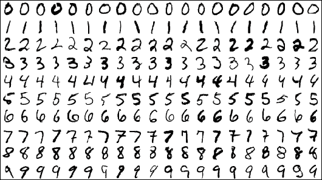
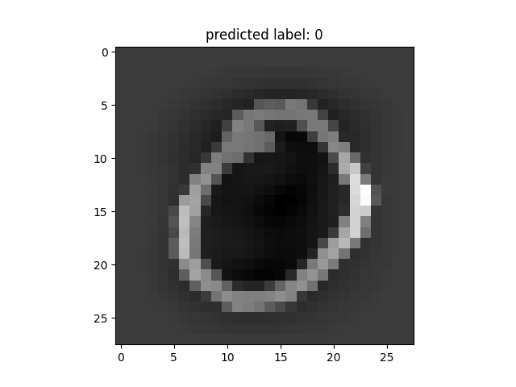
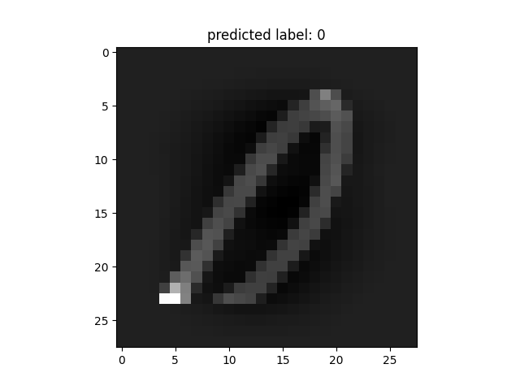
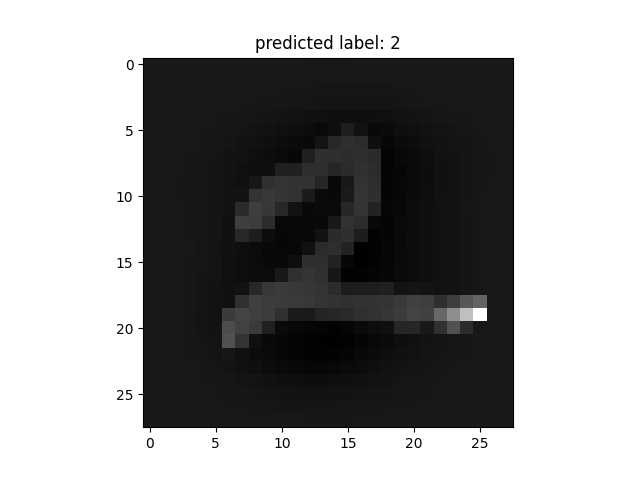
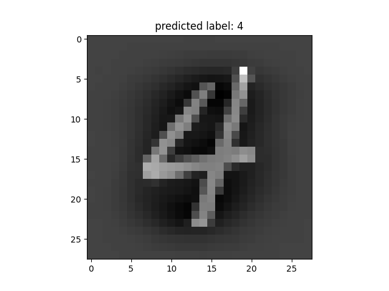
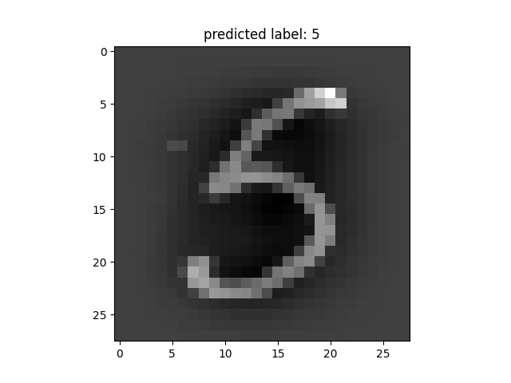
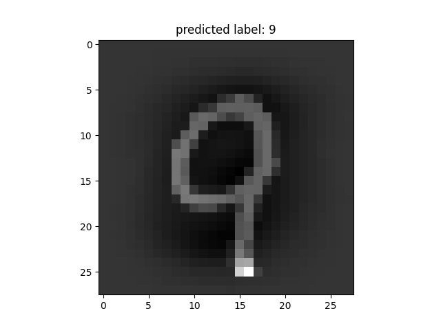

# MNIST Digit Recognition

MNIST is a dataset of handwritten digits from 0-9. Each Image is of size **28x28**.

The following models can be trained to classify the images:-
1. Logistic Regression
2. Decision Tree Classifier
3. Linear Support Vector Machine
4. Non-Linear Support Vector Machine

## Requirements
---

Download the **train.csv** and **test.csv** dataset from [Link](https://www.kaggle.com/oddrationale/mnist-in-csv).

Also download the following libraries using 

` pip install (name) `

- python3
- pandas      (for dataframe and CSV i/o)
- numpy       (for linear algebra)
- matplotlib  (for plotting images)
- sklearn     (for using pre-built algorithms)

## Tutorial
---
 Just run the *digit.py* file.

 The output will give accuracy as well as 10 images with predicted output.

